# Weather SDK  
  


## Overview

The **Weather SDK** is a **technical prototype** demonstrating a clean, type-safe interface for integrating with the OpenWeather API in Java applications. It is **not a production library**, but a scoped implementation to illustrate architectural decisions, error handling, caching strategy, and extensibility patterns.

Key capabilities include:
- Weather data retrieval by city name with structured error handling.
- Intelligent caching (LRU + TTL) to reduce API load.
- Two operational modes: `ON_DEMAND` and `POLLING`.
- Multi-API-key registry with instance lifecycle control.
- Built-in metrics (`SDKMetrics`) for observability.
- Thread-safe, immutable configuration via builder pattern.

> ⚠️ **Prototype disclaimer**: This repository is **not intended for production use**. See *Production Considerations* below.

## License

 **Source Code & Non‑Documentation Content**
   - License CC BY‑NC‑ND 4.0 International for source code files and non-documentation contents

 **Documentation**
   - License CC BY‑SA 4.0 International for documentation

## Features

| Feature | Description |
|--------|-------------|
| **Builder-pattern configuration** | `WeatherSDKBuilder` creates immutable, validated `SDKConfiguration` objects. |
| **Caching** | `DefaultWeatherCache` with LRU eviction, TTL expiration, and city-name normalisation. |
| **Metrics** | `SDKMetrics` tracks requests, cache hits/misses, response times, cache hit rate percentage, success rate percentage, and last API call timestamp. |
| **Registry** | `SDKRegistry` manages multiple SDK instances by API key (thread-safe). |
| **Exception hierarchy** | `WeatherSDKException` and specific subclasses for precise error handling. |
| **Operation modes** | `ON_DEMAND` (default) and `POLLING` (background updates). |
| **Retry mechanism** | Configurable retry attempts and delay for failed API calls |
| **Extensibility** | Placeholder modules for future **MCP (Model-Calling Protocol)** and tool-calling interfaces — architecture is prepared, implementation is out of scope. |
| **Quality gates** | Maven build includes Checkstyle, PMD, SpotBugs, JaCoCo (>40% coverage), and OWASP Dependency-Check.<br>> 📝 **Note**: 40% coverage is acceptable for this prototype. Production requires ≥80% (see [Production Considerations](#production-considerations)).<br>> 📝 **Note**: OWASP Dependency-Check is **optional** for this prototype. Production requires mandatory security scanning (see [Production Considerations](#production-considerations)). |

## Configuration Parameters

| Parameter | Type | Default Value | Description |
|-----------|------|---------------|-------------|
| **apiKey** | `String` | (required) | OpenWeatherAPI authentication key |
| **mode** | `SDKMode` | `ON_DEMAND` | Operation mode: ON_DEMAND or POLLING |
| **pollingInterval** | `Duration` | 5 minutes | Interval for background polling (POLLING mode only) |
| **cacheSize** | `int` | 10 | Maximum number of cities to cache |
| **cacheTTL** | `Duration` | 10 minutes | Time-to-live for cached weather data |
| **connectionTimeout** | `Duration` | 5 seconds | HTTP connection timeout |
| **readTimeout** | `Duration` | 10 seconds | HTTP read timeout |
| **maxRetries** | `int` | 3 | Maximum number of retry attempts for failed API calls |
| **retryDelayMs** | `long` | 500L | Delay between retry attempts in milliseconds |

## Data Model Features

The Weather SDK provides rich data model classes with extensive functionality:

### Wind Data Features
- **Beaufort Scale Calculations**: Convert wind speed to Beaufort scale (0-12) with descriptive categories
- **Cardinal Direction Conversion**: Convert meteorological degrees (0-360°) to cardinal directions (N, NE, E, SE, S, SW, W, NW)
- **Wind Description Methods**: Get human-readable wind condition descriptions (e.g., "Calm", "Gentle breeze", "Gale")
- **Multiple Unit Conversions**: Convert wind speed to mph, km/h, and knots
- **Wind Condition Checks**: Determine if wind is strong (>13 m/s) or calm (<2 m/s)

### Temperature Features
- **Temperature Conversion Utilities**: Convert between Kelvin, Celsius, and Fahrenheit
- **Comfort Level Detection**: Check if temperature is comfortable (18-24°C) or freezing (≤0°C)
- **Temperature Descriptions**: Get descriptive categories (e.g., "Cold", "Mild", "Hot", "Very Hot")
- **Feels-Like Calculations**: Access perceived temperature accounting for wind and humidity
- **Temperature Difference**: Calculate the difference between actual and perceived temperature

### System Info Features
- **Daylight Duration Calculations**: Calculate day length, sunrise/sunset times, and daylight hours
- **Sunrise/Sunset Formatting Methods**: Format times in 12-hour ("7:27 AM") or 24-hour ("07:27") formats
- **Daytime Detection**: Check if current time is between sunrise and sunset
- **Time Until Events**: Calculate duration until next sunrise or sunset
- **Day Length Descriptions**: Get human-readable descriptions of daylight duration

## Out of Scope

Industry‑standard distribution structure and versioning practices are **not implemented** and **will not be included** in this project. The SDK does not provide a production‑grade Maven artifact layout, nor does it follow conventional versioning schemes required for enterprise distribution. These aspects fall outside the current scope and are intentionally omitted.

Additionally, the following are **not implemented** and **will not be included** in the current scope:

- Industry‑standard code coverage thresholds (e.g., ≥80% coverage)
- CI/CD pipelines for automated building, testing, and deployment
- Security scanning, including SAST, DAST, and OWASP guideline compliance
- Load and performance testing

These items also fall outside the current scope.

## Prerequisites

- Java 17+
- Maven (for building)
- OpenWeather API key (optional, for running examples)

## Installation

```bash
# Build and install locally
mvn clean install -pl weather-sdk-core
```

Add to your project (local use only):

```xml
<dependency>
  <groupId>com.weather</groupId>
  <artifactId>weather-sdk-core</artifactId>
  <version>1.0.0-SNAPSHOT</version>
</dependency>
```

> 🔒 **Note**: This artifact is **not published to Maven Central** and is not intended for public distribution.

## Running the Examples

The SDK provides three self‑contained example programs that illustrate the main features:
- [`MinimalWeatherSDKExample.java`](examples/java/com/weather/sdk/examples/MinimalWeatherSDKExample.java) – basic usage, caching, and error handling. [Detailed documentation](examples-docs/README_MINIMAL_EXAMPLE.md)
- [`PollingModeExample.java`](examples/java/com/weather/sdk/examples/PollingModeExample.java) – demonstrates the automatic background polling mode. [Detailed documentation](examples-docs/README_POLLING_MODE.md)
- [`SimpleSDKRegistryExample.java`](examples/java/com/weather/sdk/examples/SimpleSDKRegistryExample.java) – shows multi‑API‑key registry management and a simple fail‑over strategy. [Detailed documentation](examples-docs/README_SDKREGISTRY_EXAMPLE.md)

Each example can be executed with its dedicated helper script:
- **Minimal example**: `./run-example.sh` – compiles and runs `MinimalWeatherSDKExample`.
- **Polling mode example**: `./run-polling-example.sh` – compiles (if needed) and runs `PollingModeExample`.
- **SDK registry example**: `./run-simple-sdkregistry-example.sh` – runs `SimpleSDKRegistryExample` after verifying required API keys.

```bash
./run-example.sh
./run-polling-example.sh
./run-simple-sdkregistry-example.sh
```

(See the scripts in the repository root for further setup details.)

## Configuration & API Usage

```java
SDKConfiguration config = new WeatherSDKBuilder()
    .apiKey("your_key")
    .mode(SDKMode.ON_DEMAND)
    .cacheSize(10)
    .cacheTTL(Duration.ofMinutes(10))
    .maxRetries(3)
    .retryDelayMs(500L)
    .build();

try (WeatherSDK sdk = new DefaultWeatherSDK(config)) {
    WeatherData data = sdk.getWeather("London");
    System.out.println(data);
}
```

Full Javadoc is available as [compiled Javadoc](docs/) and can be served [here](https://vyacheslav-v-p.github.io/WeatherSDK/) via GitHub Pages.

## Extensibility (MCP Placeholder)

The SDK includes placeholder modules for future **Model-Calling Protocol (MCP)** and **tool-calling interfaces**.  
These are **not implemented**, but the architecture provides clear extension points (e.g., dedicated packages, interface contracts).  
When final specs are agreed upon, AI-driven features can be integrated without breaking existing code.

## Production Considerations

This prototype **must not be used in production** without significant enhancements, including:
- Raising test coverage to ≥80%,
- Finalising public API contracts (e.g., `String getWeatherAsJson(String city)`),
- Resolving all static analysis suppressions,
- Implementing CI/CD, security scanning (SAST/DAST, OWASP),
- Adding feature flags, load testing, cross-JVM config sync,
- Supporting user-configurable units (metric/imperial).

These decisions require explicit agreement within an engineering team.

## Architecture (Mermaid source)

```mermaid
flowchart TD
    %% Multi-module Project Structure
    subgraph Project[Weather SDK Project]
        subgraph CoreSDK[Core SDK Module]
            WeatherSDK[WeatherSDK Interface]
            DefaultWeatherSDK[DefaultWeatherSDK<br/>Thread-safe implementation]
        end

        subgraph Config[Configuration System]
            subgraph SDKConfiguration[SDKConfiguration]
                TimeoutConfig[TimeoutConfig Record<br/>HTTP timeout configuration<br/>nested record]
            end
            WeatherSDKBuilder[WeatherSDKBuilder<br/>Fluent builder with validation]
            SDKMode[SDKMode<br/>ON_DEMAND or POLLING]
            WeatherSDKBuilder -.->|builds| SDKConfiguration
            SDKConfiguration -->|contains| SDKMode
        end

        %% Registry System
        subgraph Registry[Registry Management]
            SDKRegistry[SDKRegistry<br/>Thread-safe registry for<br/>multiple SDK instances]
            SDKRegistry -->|manages| DefaultWeatherSDK
        end

        %% Caching Layer
        subgraph Cache[Caching Layer]
            WeatherCache[WeatherCache Interface]
            subgraph DefaultWeatherCache[DefaultWeatherCache]
                CacheEntry[CacheEntry Internal Class<br/>Stores data with timestamp<br/>private static nested class]
            end
        end

        %% HTTP Client Layer
        subgraph Client[HTTP Client Layer]
            OpenWeatherApiClient[OpenWeatherApiClient Interface]
            DefaultOpenWeatherApiClient[DefaultOpenWeatherApiClient<br/>Java 17 HttpClient<br/>Retry logic & error handling]
        end

        %% Metrics System
        subgraph Metrics[Metrics & Monitoring]
            SDKMetrics[SDKMetrics<br/>Immutable snapshot<br/>Atomic counters]
        end

        %% Data Models
        subgraph Models[Data Models]
            WeatherData[WeatherData<br/>Main weather data object]
            Weather[Weather<br/>Weather conditions]
            Temperature[Temperature<br/>Temperature data]
            Wind[Wind<br/>Wind information]
            SystemInfo[SystemInfo<br/>Sunrise/sunset data]
            WeatherData -->|contains| Weather
            WeatherData -->|contains| Temperature
            WeatherData -->|contains| Wind
            WeatherData -->|contains| SystemInfo
        end

        %% Exception Hierarchy
        subgraph Exceptions[Exception Hierarchy]
            WeatherSDKException[WeatherSDKException<br/>Base exception]
            ApiKeyException[ApiKeyException<br/>Invalid API key]
            CityNotFoundException[CityNotFoundException<br/>City not found]
            RateLimitException[RateLimitException<br/>Rate limit exceeded]
            NetworkException[NetworkException<br/>Network/HTTP errors]
            CacheException[CacheException<br/>Cache operation failures]
            ConfigurationException[ConfigurationException<br/>Invalid configuration]
        end

        %% Dependencies
        subgraph Dependencies[External Dependencies]
            Jackson[Jackson<br/>JSON processing]
            SLF4J[SLF4J<br/>Logging framework]
            HttpClient[Java 17 HttpClient<br/>HTTP communication]
        end
    end

    %% Extensibility Modules (Empty placeholders)
    subgraph Extensibility[Extensibility Modules]
        MCP[weather-sdk-mcp<br/>MCP placeholder<br/>Empty module]
        AITools[weather-sdk-ai-tools<br/>AI tools placeholder<br/>Empty module]
    end

    %% External API
    ExternalAPI[OpenWeatherAPI<br/>External weather service]

    %% Notes:
    %% - Nested classes (e.g., TimeoutConfig, CacheEntry) are shown inside their parent classes
    %% - Separate classes are shown as individual nodes in their respective subgraphs

    %% Main Relationships
    DefaultWeatherSDK -->|uses| SDKConfiguration
    DefaultWeatherSDK -->|caches via| WeatherCache
    DefaultWeatherSDK -->|calls| OpenWeatherApiClient
    DefaultWeatherSDK -->|exposes| SDKMetrics
    DefaultWeatherSDK -->|returns| WeatherData
    DefaultWeatherSDK -->|throws| WeatherSDKException
    WeatherSDKException -.->|extended by| ApiKeyException
    WeatherSDKException -.->|extended by| CityNotFoundException
    WeatherSDKException -.->|extended by| RateLimitException
    WeatherSDKException -.->|extended by| NetworkException
    WeatherSDKException -.->|extended by| CacheException
    WeatherSDKException -.->|extended by| ConfigurationException

    OpenWeatherApiClient -->|HTTP requests| ExternalAPI
    OpenWeatherApiClient -->|uses| HttpClient
    OpenWeatherApiClient -->|parses with| Jackson

    WeatherSDKBuilder -.->|builds| SDKConfiguration
    WeatherSDKBuilder -->|validates| ConfigurationException

    DefaultWeatherSDK -->|logs with| SLF4J

    %% Additional relationships for updated components
    DefaultWeatherCache -->|contains| CacheEntry
    SDKConfiguration -->|contains| TimeoutConfig

    %% Styling
    classDef interface fill:#e1f5fe
    classDef implementation fill:#f3e5f5
    classDef configuration fill:#e8f5e8
    classDef data fill:#fff3e0
    classDef exception fill:#ffebee
    classDef external fill:#f5f5f5
    classDef placeholder fill:#f1f8e9
    classDef nested fill:#dcedc8

    class WeatherSDK,WeatherCache,OpenWeatherApiClient interface
    class DefaultWeatherSDK,DefaultOpenWeatherApiClient implementation
    class WeatherSDKBuilder,SDKMode configuration
    class SDKConfiguration configuration
    class DefaultWeatherCache implementation
    class TimeoutConfig,CacheEntry nested
    class WeatherData,Weather,Temperature,Wind,SystemInfo data
    class WeatherSDKException,ApiKeyException,CityNotFoundException,RateLimitException,NetworkException,CacheException,ConfigurationException exception
    class Jackson,SLF4J,HttpClient,ExternalAPI external
    class MCP,AITools placeholder
```

<!-- Copy to https://mermaid.live to visualise -->


## Documentation

- **Javadoc**: [Browse compiled Javadoc via GitHub Pages](https://vyacheslav-v-p.github.io/WeatherSDK/)
- **Examples**:
  - [Minimal Example Documentation](examples-docs/README_MINIMAL_EXAMPLE.md)
  - [Polling Mode Documentation](examples-docs/README_POLLING_MODE.md)
  - [SDK Registry Example Documentation](examples-docs/README_SDKREGISTRY_EXAMPLE.md)
- **Builder rules**: enforced at build time

## Dependencies

The Weather SDK Core module uses the following dependencies:

### Runtime Dependencies
- **Jackson**: `jackson-databind`, `jackson-core`, `jackson-annotations` - for JSON processing and data binding
- **SLF4J**: `slf4j-api` - for logging framework abstraction

### Test Dependencies
- **JUnit 5**: `junit-jupiter` - for unit testing framework
- **Mockito**: `mockito-core`, `mockito-junit-jupiter` - for mocking in tests

### Build & Quality Tools
- **Maven plugins**: Compiler, Surefire, Javadoc, Source plugins for build process
- **JaCoCo**: For test coverage reporting
- **Checkstyle**: For code style enforcement
- **PMD**: For static code analysis
- **SpotBugs**: For bug detection
- **OWASP Dependency Check**: For security vulnerability scanning

## Contact

Weather SDK Documentation © 2025 by <vyacheslav.v.pl@yandex.ru> is licensed under CC BY-SA 4.0
Author: <vyacheslav.v.pl@yandex.ru> 

